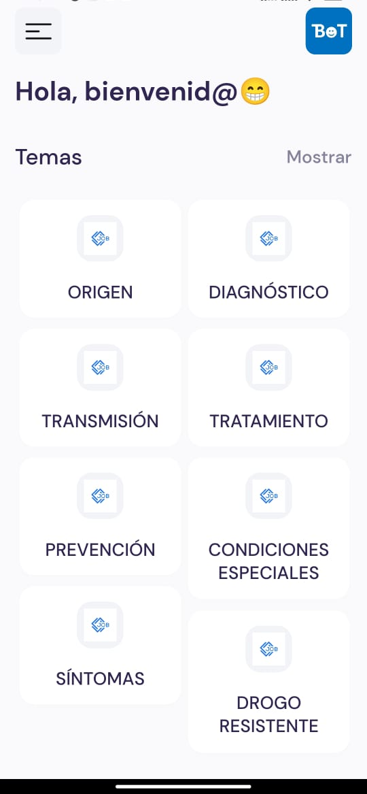
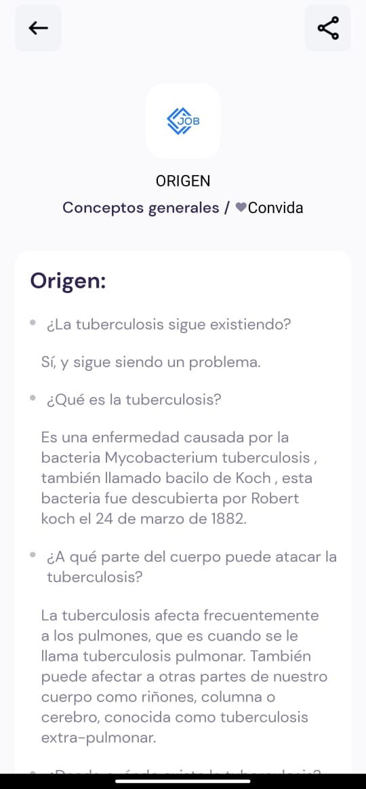
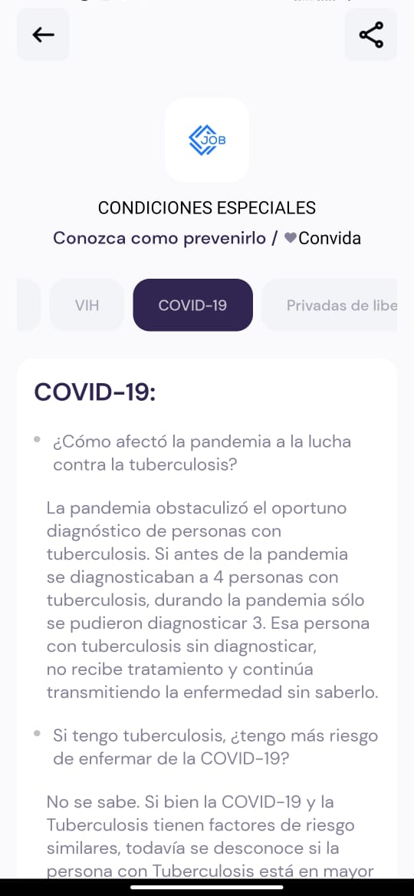

# TBoT (app in React Native)

El presente proyecto fue desarrollado con Expo y React Native con el objetivo de ser usado para una investigación en pacientes con tuberculosis😷 organizado por la médica Carolina Martínez-Dávalos, MD (Research Assistant).

## 🚀 Como usar

La aplicación en su versión actual puede descargarse directamente a través del presente link como APK:

```
https://expo.dev/artifacts/eas/qqH5VUc8k4eTKBuxSG8xCB.apk
```

## 📝 Notas

- Información utilizada en la app proporcionada por Carolina Martínez-Dávalos (martinezdavaloscarolina@gmail.com)

## 📷 Screenshot






